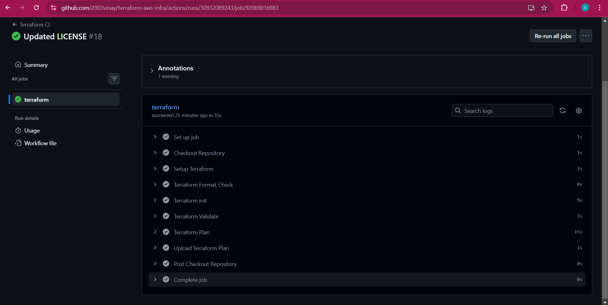
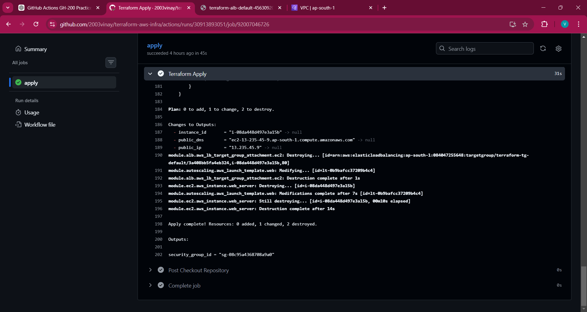
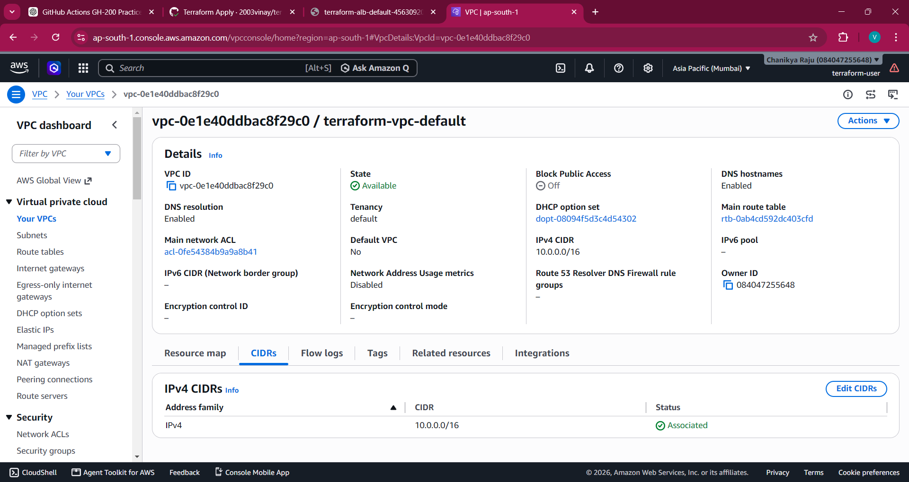
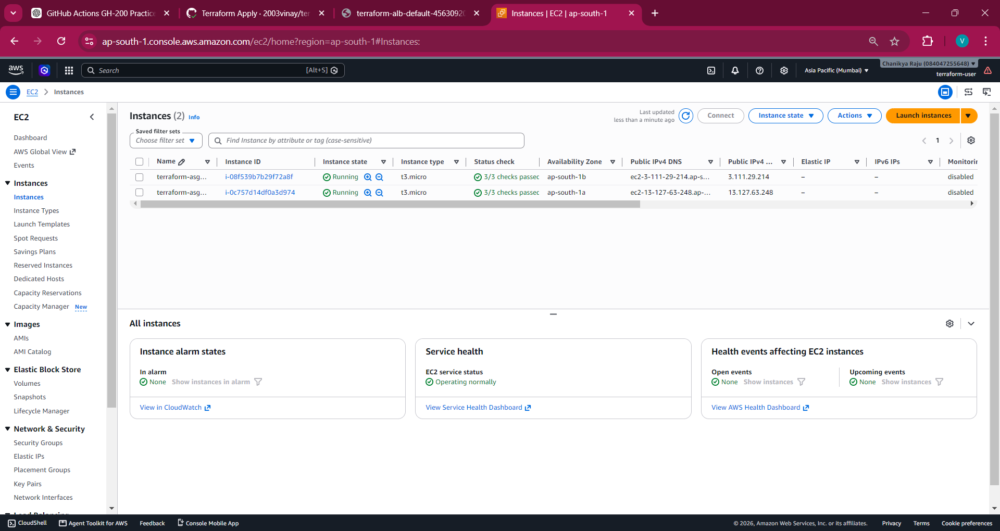
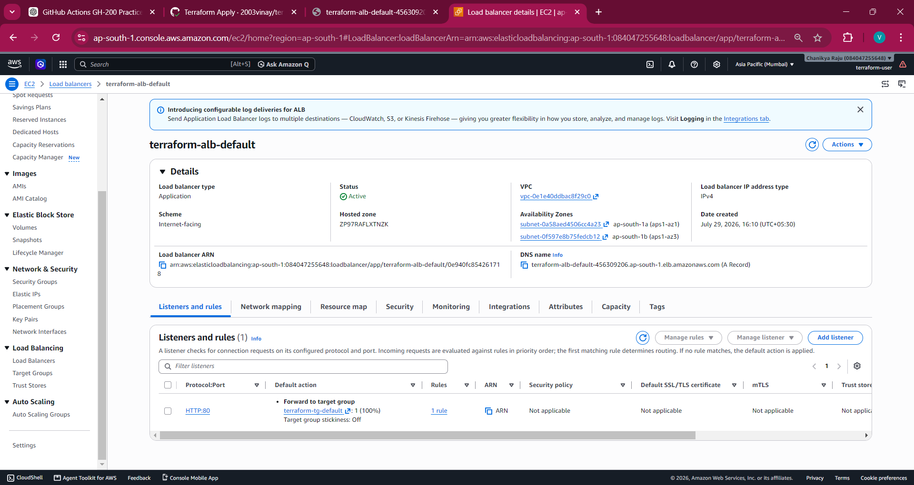
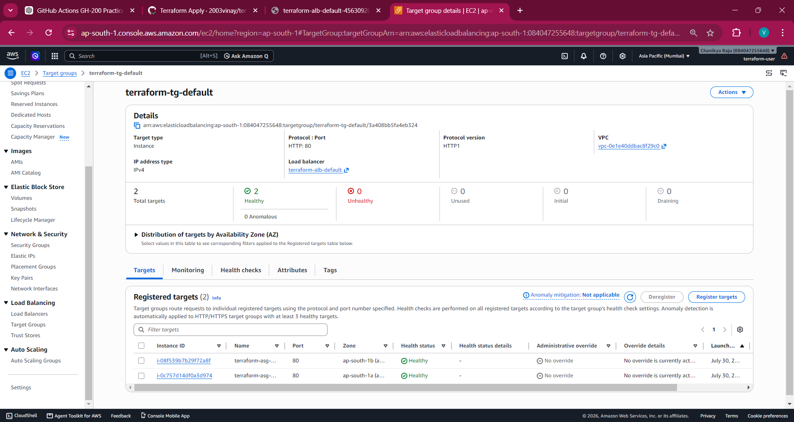
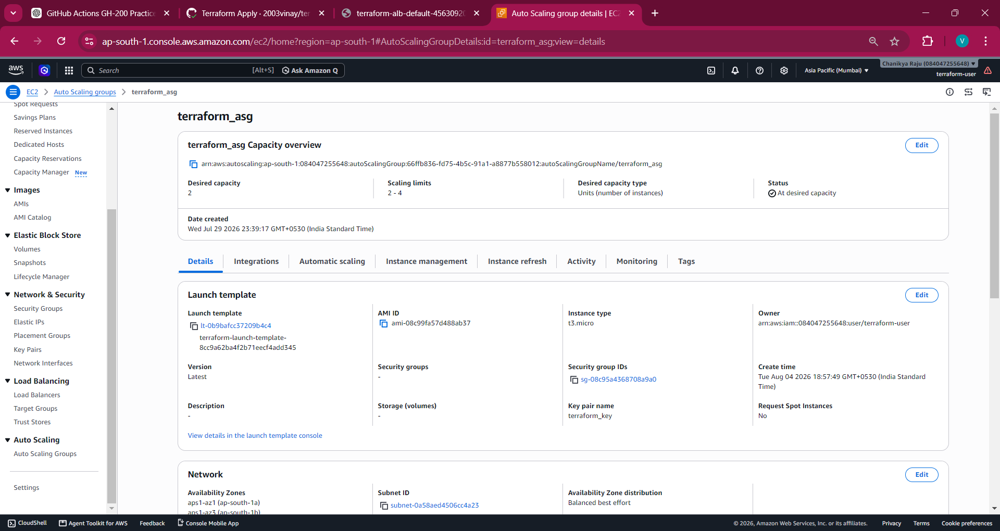
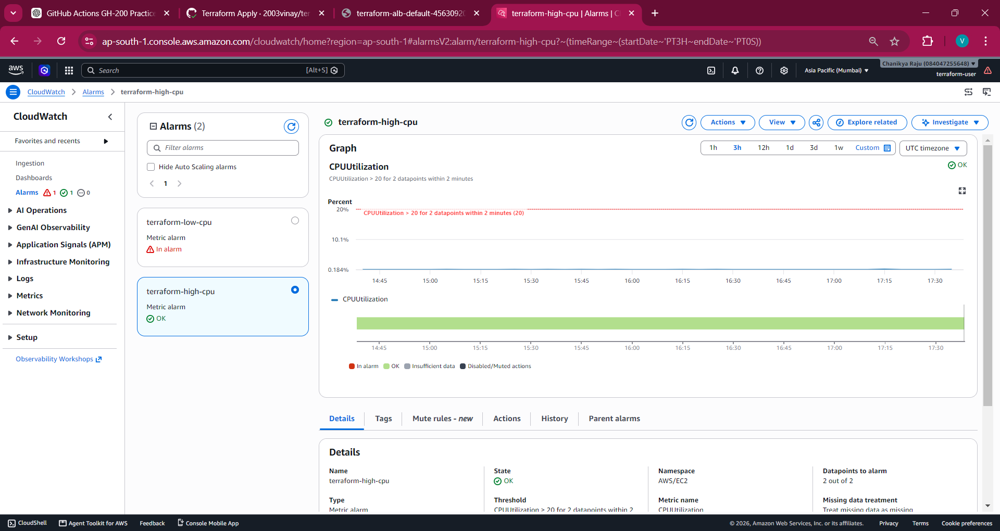
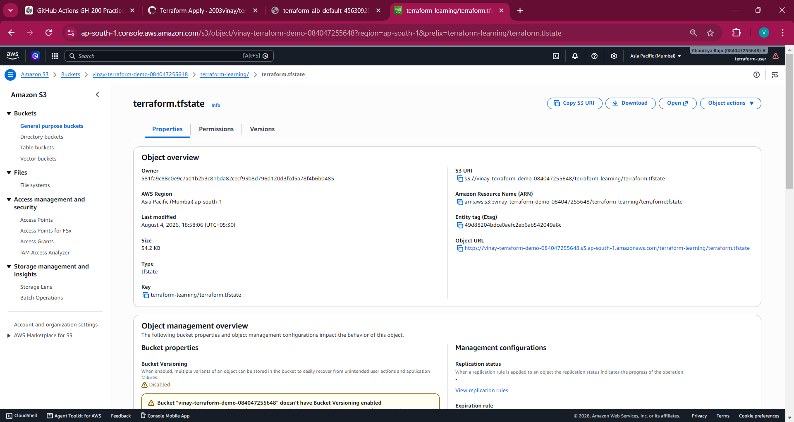
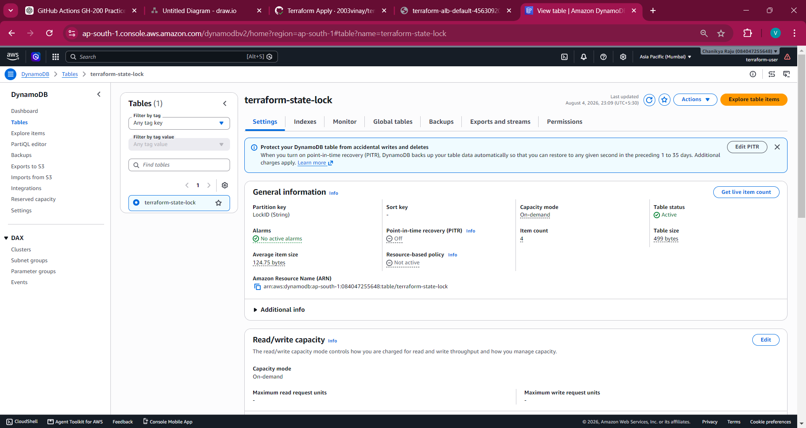

# 🚀 Terraform AWS Infrastructure Provisioning

## 📖 Overview

This project provisions production-style AWS infrastructure using Terraform.

The infrastructure is organized into reusable Terraform modules and follows Infrastructure as Code (IaC) best practices. The project also includes GitHub Actions workflows for Continuous Integration and manual deployment.

---

## ✨ Features

- Modular Terraform code
- Remote backend (S3)
- State locking (DynamoDB)
- VPC with public subnets
- Internet Gateway
- Route Tables
- Security Groups
- EC2
- Application Load Balancer
- Launch Template
- Auto Scaling Group
- CloudWatch Auto Scaling
- GitHub Actions CI/CD

---

## 📁 Project Structure

terraform-aws-infra/
├── .github/
│   └── workflows/
│       ├── terraform.yml
│       ├── apply.yml
│       └── destroy.yml
├── environments/
│   └── dev.tfvars.example
├── modules/
│   ├── alb/
│   ├── autoscaling/
│   ├── ec2/
│   ├── security-group/
│   └── vpc/
├── backend.tf
├── main.tf
├── outputs.tf
├── variables.tf
└── README.md

---

## ☁️ AWS Services Used

- VPC
- EC2
- ALB
- Auto Scaling
- Launch Template
- CloudWatch
- IAM Key Pair
- S3
- DynamoDB

---

## 🔄 GitHub Actions

### CI Pipeline

- Terraform fmt
- Terraform init
- Terraform validate
- Terraform plan
- Upload tfplan artifact

### Apply Workflow

Manual workflow that initializes Terraform and applies the infrastructure.

### Destroy Workflow

Manual workflow to destroy infrastructure.

---

## 🔐 Remote Backend

Terraform state is stored remotely using:

- Amazon S3
- DynamoDB State Locking

---

## 📈 Auto Scaling

- Launch Template
- Auto Scaling Group
- CPU-based Scale Up
- CPU-based Scale Down

---

## ▶️ Getting Started

Clone repository

git clone https://github.com/2003vinay/terraform-aws-infra.git

Create tfvars

Copy

environments/dev.tfvars.example

to

terraform.tfvars

Run

terraform init

terraform plan

terraform apply

---

---

# 📸 Project Screenshots

## 🚀 GitHub Actions CI Pipeline

The GitHub Actions workflow automatically performs Terraform formatting, initialization, validation, and execution planning on every push or pull request.

---

## 📋 Terraform Apply

Terraform generates an execution plan showing the resources that will be created, modified, or destroyed before applying any changes.
Terraform executes the reviewed plan

---

## 🌐 Virtual Private Cloud (VPC)

A custom VPC was provisioned using Terraform to provide an isolated networking environment for the infrastructure.

---

## 💻 EC2 Instance

Amazon EC2 instances are provisioned through an Auto Scaling Group using a Launch Template.

---

## ⚖️ Application Load Balancer (ALB)

The Application Load Balancer distributes incoming traffic across multiple EC2 instances to improve availability and scalability.

---

## 🎯 Target Group

The Target Group registers healthy EC2 instances and routes traffic received from the Application Load Balancer.

---

## 📈 Auto Scaling Group

The Auto Scaling Group automatically launches or terminates EC2 instances based on CloudWatch CPU utilization alarms.

---

## 📊 CloudWatch Alarm

CloudWatch monitors CPU utilization and triggers Auto Scaling policies when predefined thresholds are exceeded.

---

## 🪣 Remote Terraform State (Amazon S3)

Terraform state is securely stored in an Amazon S3 bucket, enabling remote state management.

---

## 🔒 Terraform State Locking (DynamoDB)

Amazon DynamoDB is used for Terraform state locking, preventing simultaneous state modifications during infrastructure deployment.

---
---

## 📚 Learning Outcomes

- Terraform Modules
- Remote State
- GitHub Actions
- Auto Scaling
- CloudWatch
- ALB
- Infrastructure as Code
- CI/CD Automation

---

## 🔮 Future Enhancements

- RDS
- Bastion Host
- Private Subnets
- NAT Gateway
- ECS
- EKS
- WAF
- Route53
- ACM